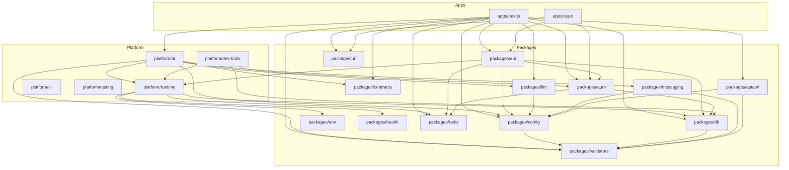

# Architecture

## Overview

`dw-portfolio-platform` is a full-stack TypeScript monorepo built on Turborepo and pnpm workspaces. It serves two simultaneous purposes: a public-facing portfolio website (Next.js + React Native/Expo) and an AI-powered internal DevOps platform that automatically detects, analyzes, and tracks CI failures, runtime errors, and Dependabot security vulnerabilities. All external events (GitHub webhooks, Sentry webhooks) flow through an Edge-runtime receive layer, are enqueued in Upstash QStash for durable delivery, processed by Node.js-runtime AI agents powered by Claude (Anthropic), and written to Upstash Redis for display in the admin platform dashboard.

---

## Tech Stack

| Technology | Role | Version |
|---|---|---|
| **Next.js** | Primary web application (App Router) | 15.x |
| **Expo / React Native** | Mobile application | SDK 54 |
| **tRPC** | Type-safe API layer | 11.x |
| **Drizzle ORM** | Database ORM with Zod schema integration | latest |
| **PostgreSQL** (Supabase) | Primary relational database | 16 |
| **Upstash Redis** | Incident memory store, rate limiting, dedup cache | 7.x (local), REST API (cloud) |
| **Upstash QStash** | Durable job queue with retries for AI agents | v2 |
| **Anthropic Claude** | AI analysis of CI failures, Sentry errors, security alerts | `claude-sonnet-4-20250514` |
| **Clerk** | Authentication and user management | 6.x |
| **Resend** | Transactional email (contact form + incident alerts) | 6.x |
| **Sentry** | Error tracking and performance monitoring | @sentry/nextjs |
| **Terraform** | Infrastructure-as-code (cloud resource provisioning) | ~1.14.6 |
| **Doppler** | Secrets management for all environments | — |
| **Cloudflare** | DNS, tunnel for local dev | provider ~5.18 |
| **Vercel** | Hosting and deployment for Next.js | — |
| **Turborepo** | Monorepo build orchestration with remote caching | 2.x |
| **pnpm** | Package manager with workspace support | 10.x |
| **TypeScript** | Language | ~5.9.x |
| **Tailwind CSS** | Utility-first styling | 4.x |
| **Vitest** | Unit and integration testing | 4.x |

---

## Monorepo Structure

```
dw-portfolio-platform/
├── apps/
│   ├── nextjs/          # Primary web app: portfolio + admin platform dashboard
│   └── expo/            # React Native mobile app (posts, auth)
│
├── packages/
│   ├── api/             # tRPC router definitions (auth, post, contact)
│   ├── auth/            # Auth primitives: Clerk integration, RBAC, user provisioning
│   ├── config/          # Unified runtime config object (composes all env validators)
│   ├── contracts/       # Shared types: PlatformEvent, IncidentRecord, QStash payloads
│   ├── db/              # Drizzle ORM client, schema (user, post), migrations
│   ├── env/             # Re-exports for environment variable access
│   ├── health/          # Infrastructure health check primitives
│   ├── llm/             # Anthropic SDK client + analyzeEvent() + XML response parser
│   ├── messaging/       # Resend email client: contact form + incident alert emails
│   ├── qstash/          # Upstash QStash client: publish/verify job payloads
│   ├── redis/           # Upstash Redis client singleton + rate limiting
│   ├── ui/              # Shared React component library (shadcn/ui primitives)
│   └── validators/      # Per-domain env validators using @t3-oss/env-core + Zod
│
├── platform/
│   ├── ai/              # AI agent system: sensors, analyzers, actions, Redis memory
│   ├── cli/             # `pnpm dw` CLI: domain-routed commands for db, infra
│   ├── dev-tools/       # Docker Compose local infra, DB seed/setup scripts
│   ├── infra/           # Terraform modules: Vercel, Cloudflare, Supabase, Upstash, Doppler
│   ├── pipelines/       # Placeholder — future CI/CD pipeline definitions
│   ├── runtime/         # Runtime detection, capability guards, singleton factories
│   ├── standards/       # Shared ESLint, TypeScript, Tailwind, Prettier, GitHub configs
│   ├── telemetry/       # Placeholder — future observability tooling
│   └── testing/         # Shared Vitest config, test setup guards
│
├── docs/
│   └── incidents/       # Auto-generated incident markdown files (committed by AI agents)
│
├── turbo.json           # Turborepo task pipeline definitions
├── pnpm-workspace.yaml  # Workspace package list + catalog dependency versions
└── doppler.yaml         # Doppler project/config pointer (dev environment)
```

---

## Package Dependency Graph



---

## System Architecture Diagram

```mermaid
graph TD
    subgraph External["External Services"]
        GH[GitHub Webhooks]
        SR[Sentry Webhooks]
        CLK[Clerk Auth]
        ANT[Anthropic API]
        VAPI[Vercel API]
        SAPI[Sentry REST API]
    end

    subgraph Edge["Edge Runtime (Vercel Edge)"]
        WHG[/api/webhooks/github]
        WHS[/api/webhooks/sentry]
        TRPC[/api/trpc]
    end

    subgraph Queue["Upstash QStash"]
        Q_CI[ci.failure job]
        Q_SN[sentry.incident job]
        Q_SEC[security.alert job]
        Q_RES[resolve job]
    end

    subgraph Node["Node.js Runtime (Vercel Serverless, maxDuration 300s)"]
        PCI[/api/process/ci]
        PSN[/api/process/sentry]
        PSEC[/api/process/security]
        PRES[/api/process/resolve]
        MRES[/api/platform/incidents/id/resolve]
    end

    subgraph Agents["AI Agents (platform/ai)"]
        CIA[CI Agent]
        SNA[Sentry Agent]
        SECA[Security Agent]
    end

    subgraph Memory["Upstash Redis Memory"]
        INC[platform:incident:*]
        IDX[platform:incidents:index]
        EVT[platform:events]
        DDP[dedup keys]
    end

    subgraph Outputs["Agent Outputs"]
        GHI[GitHub Issue]
        GHC[GitHub PR Comment]
        GHF[Incident Doc committed to docs/incidents/]
        EMAIL[Resend Email]
    end

    subgraph DB["Supabase PostgreSQL"]
        USR[user table]
        PST[post table]
    end

    subgraph Dashboard["Admin Dashboard /platform"]
        DASH[Platform overview]
        INCP[Incidents page]
        DEP[Deployments page]
    end

    GH -->|HMAC verified| WHG
    SR -->|HMAC verified| WHS
    WHG -->|publishCiJob| Q_CI
    WHG -->|publishSecurityAlert| Q_SEC
    WHG -->|publishGithubResolution| Q_RES
    WHS -->|publishSentryJob| Q_SN
    WHS -->|publishSentryResolution| Q_RES

    Q_CI -->|QStash delivers, verifies| PCI
    Q_SN --> PSN
    Q_SEC --> PSEC
    Q_RES --> PRES

    PCI --> CIA
    PSN --> SNA
    PSEC --> SECA

    CIA --> ANT
    SNA --> ANT
    SECA --> ANT

    CIA --> GHI
    CIA --> GHC
    CIA --> GHF
    CIA --> EMAIL
    CIA --> INC

    SNA --> GHI
    SNA --> GHF
    SNA --> EMAIL
    SNA --> INC

    SECA --> GHI
    SECA --> GHF
    SECA --> EMAIL
    SECA --> INC

    PRES --> INC
    MRES -->|Admin only, Clerk auth| INC

    INC --> IDX
    INCP -->|reads| IDX
    INCP -->|reads| INC
    DEP -->|calls| VAPI
    DASH -->|polls| SAPI

    TRPC -->|protectedProcedure| DB
    CLK --> TRPC
```

---

## Primary Data Flow

The following sequence diagram traces the most complex path: a GitHub CI failure triggering the full AI agent pipeline.


---

## External Integrations

| Service | Purpose | Configuration | Key Variables |
|---|---|---|---|
| **Anthropic** | LLM analysis of all platform events | `packages/llm/src/client.ts` | `ANTHROPIC_API_KEY` |
| **GitHub** | Webhook source, issue/PR creation, file commits | `platform/ai/src/actions/github.ts` | `GITHUB_TOKEN`, `GITHUB_WEBHOOK_SECRET`, `GITHUB_REPO` |
| **Sentry** | Error tracking (Next.js instrumentation) + REST API sensor | `sentry.server.config.ts`, `platform/ai/src/sensors/sentry.ts` | `SENTRY_AUTH_TOKEN`, `SENTRY_ORG`, `SENTRY_PROJECT`, `SENTRY_TOKEN`, `SENTRY_WEBHOOK_SECRET` |
| **Clerk** | User authentication, webhook for user sync | `packages/auth/src/clerk.ts`, `/api/webhooks/clerk/` | `CLERK_SECRET_KEY`, `CLERK_WEBHOOK_SECRET`, `NEXT_PUBLIC_CLERK_PUBLISHABLE_KEY` |
| **Supabase** | PostgreSQL database hosting + storage | `packages/db/src/client.ts` | `DATABASE_URL`, `DIRECT_URL`, `SUPABASE_PROJECT_REF`, `SUPABASE_SECRET_DEFAULT_KEY` |
| **Upstash Redis** | Incident memory, rate limiting, dedup TTLs | `packages/redis/src/client.ts` | `UPSTASH_REDIS_REST_URL`, `UPSTASH_REDIS_REST_TOKEN` |
| **Upstash QStash** | Durable job queue with retries + deduplication | `packages/qstash/src/client.ts` | `QSTASH_TOKEN`, `QSTASH_URL`, `QSTASH_CURRENT_SIGNING_KEY`, `QSTASH_NEXT_SIGNING_KEY` |
| **Resend** | Transactional email for contact form + incident alerts | `packages/messaging/src/resend-client.ts` | `RESEND_API_KEY`, `RESEND_FROM_EMAIL`, `RESEND_AGENT_FROM_EMAIL`, `RESEND_TO_EMAIL` |
| **Vercel** | App hosting + deployment (Next.js) | Vercel dashboard | `VERCEL_API_TOKEN`, `VERCEL_PROJECT_ID` |
| **Cloudflare** | DNS, R2 state storage, dev tunnel | `platform/infra/terraform/modules/cloudflare` | `CLOUDFLARE_API_TOKEN`, `CLOUDFLARE_ZONE_ID` |
| 

... [truncated — 683 chars omitted]

---

## Documentation Drift — 2026-03-25

> Auto-detected by platform-agent · Review and update the sections above · Remove this block when resolved

• Route `/api/cron/docs-agent` added → Update **External Integrations** section → Add documentation agent cron endpoint details
• Route `/api/platform/incidents/[id]/resolve` added → Update **Primary Data Flow** section → Add incident resolution API endpoint flow
• Route `/api/trpc/[trpc]` added → Update **Tech Stack** section → Add tRPC API routing configuration details
