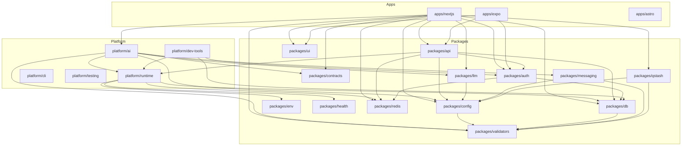
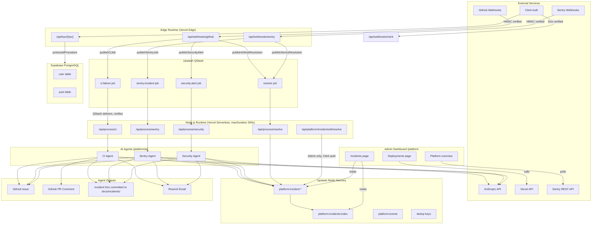
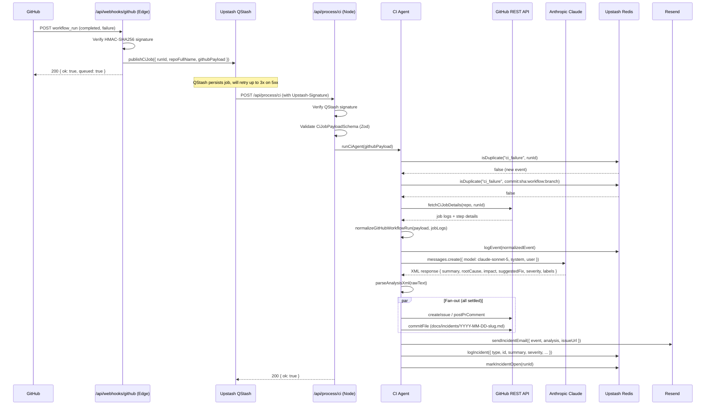

# Architecture

## Overview

`dw-portfolio-platform` is a full-stack TypeScript monorepo built on Turborepo and pnpm workspaces. It serves three simultaneous purposes: a public-facing portfolio + admin platform web app (Next.js), a recruiter-facing static portfolio site (Astro), and a mobile application (React Native/Expo) — alongside an AI-powered internal DevOps platform that automatically detects, analyzes, and tracks CI failures, runtime errors, and Dependabot security vulnerabilities. All external events (GitHub webhooks, Sentry webhooks) flow through an Edge-runtime receive layer, are enqueued in Upstash QStash for durable delivery, processed by Node.js-runtime AI agents powered by Claude (Anthropic), and written to Upstash Redis for display in the admin platform dashboard.

---

## Tech Stack

| Technology                | Role                                                                   | Version                       |
| ------------------------- | ---------------------------------------------------------------------- | ----------------------------- |
| **Next.js**               | Primary web application (App Router)                                   | 16.x                          |
| **Astro**                 | Static, recruiter-facing portfolio site (`dw-portfolio-platform-home`) | 7.x                           |
| **Expo / React Native**   | Mobile application                                                     | SDK 54                        |
| **tRPC**                  | Type-safe API layer, mounted at `/api/trpc/[trpc]`                     | 11.x                          |
| **Drizzle ORM**           | Database ORM with Zod schema integration                               | latest                        |
| **PostgreSQL** (Supabase) | Primary relational database                                            | 16                            |
| **Upstash Redis**         | Incident memory store, rate limiting, dedup cache                      | 7.x (local), REST API (cloud) |
| **Upstash QStash**        | Durable job queue with retries for AI agents                           | v2                            |
| **Anthropic Claude**      | AI analysis of CI failures, Sentry errors, security alerts             | `claude-sonnet-5`             |
| **Clerk**                 | Authentication and user management                                     | 7.x                           |
| **Resend**                | Transactional email (contact form + incident alerts)                   | 6.x                           |
| **Sentry**                | Error tracking and performance monitoring                              | @sentry/nextjs                |
| **Terraform**             | Infrastructure-as-code (cloud resource provisioning)                   | ~1.14.6                       |
| **Doppler**               | Secrets management for all environments                                | —                             |
| **Cloudflare**            | DNS, tunnel for local dev                                              | provider ~5.21                |
| **Vercel**                | Hosting and deployment (Next.js + Astro)                               | —                             |
| **Turborepo**             | Monorepo build orchestration with remote caching                       | 2.x                           |
| **pnpm**                  | Package manager with workspace support                                 | 11.x                          |
| **TypeScript**            | Language                                                               | ~5.9.x                        |
| **Tailwind CSS**          | Utility-first styling                                                  | 4.x                           |
| **Vitest**                | Unit and integration testing                                           | 4.x                           |

---

## Monorepo Structure

```
dw-portfolio-platform/
├── apps/
│   ├── astro/           # Recruiter-facing static portfolio site (Vercel static output)
│   ├── nextjs/          # Primary web app: portfolio + admin platform dashboard
│   └── expo/            # React Native mobile app (posts, auth)
│
├── packages/
│   ├── api/             # tRPC router definitions (auth, post, contact)
│   ├── auth/             # Auth primitives: Clerk integration, RBAC, user provisioning
│   ├── config/           # Unified runtime config object (composes all env validators)
│   ├── contracts/        # Shared types: PlatformEvent, IncidentRecord, QStash payloads
│   ├── db/               # Drizzle ORM client, schema (user, post), migrations
│   ├── env/               # Re-exports for environment variable access
│   ├── health/            # Infrastructure health check primitives
│   ├── llm/                # Anthropic SDK client + analyzeEvent() + XML response parser
│   ├── messaging/         # Resend email client: contact form + incident alert emails
│   ├── qstash/             # Upstash QStash client: publish/verify job payloads
│   ├── redis/              # Upstash Redis client singleton + rate limiting
│   ├── ui/                  # Shared React component library (shadcn/ui primitives)
│   └── validators/         # Per-domain env validators using @t3-oss/env-core + Zod
│
├── platform/
│   ├── ai/               # AI agent system: sensors, analyzers, actions, Redis memory
│   ├── cli/                # `pnpm dw` CLI: domain-routed commands for db, infra
│   ├── dev-tools/          # Docker Compose local infra, DB seed/setup scripts
│   ├── infra/               # Terraform modules: Vercel, Cloudflare, Supabase, Upstash, Doppler
│   ├── pipelines/           # Placeholder — future CI/CD pipeline definitions
│   ├── runtime/             # Runtime detection, capability guards, singleton factories
│   ├── standards/            # Shared ESLint, TypeScript, Tailwind, Prettier, GitHub configs
│   ├── telemetry/            # Placeholder — future observability tooling
│   └── testing/               # Shared Vitest config, test setup guards
│
├── docs/
│   └── incidents/         # Auto-generated incident markdown files (committed by AI agents)
│
├── turbo.json           # Turborepo task pipeline definitions
├── pnpm-workspace.yaml  # Workspace package list + catalog dependency versions + overrides
└── doppler.yaml         # Doppler project/config pointer (dev environment)
```

---

## Package Dependency Graph



> **Note:** `apps/astro` has no internal `@dw/*` package dependencies — it fetches career content from the standalone `career-data` Go service (`CAREER_DATA_URL`) over HTTP rather than importing any workspace package directly, and gracefully falls back to bundled static content if that service is unreachable (see `fetchWithFallback` in `apps/astro/src/lib/`).

---

## System Architecture Diagram



---

## Primary Data Flow

The following sequence diagram traces the most complex path: a GitHub CI failure triggering the full AI agent pipeline.



---

## External Integrations

| Service            | Purpose                                                                                      | Configuration                                                  | Key Variables                                                                                                        |
| ------------------ | -------------------------------------------------------------------------------------------- | -------------------------------------------------------------- | -------------------------------------------------------------------------------------------------------------------- |
| **Anthropic**      | LLM analysis of all platform events                                                          | `packages/llm/src/client.ts`                                   | `ANTHROPIC_API_KEY`                                                                                                  |
| **GitHub**         | Webhook source (`/api/webhooks/github`), issue/PR creation, file commits                     | `platform/ai/src/actions/github.ts`                            | `GITHUB_TOKEN`, `GITHUB_WEBHOOK_SECRET`, `GITHUB_REPO`                                                               |
| **Sentry**         | Error tracking (Next.js instrumentation) + REST API sensor, webhook (`/api/webhooks/sentry`) | `sentry.server.config.ts`, `platform/ai/src/sensors/sentry.ts` | `SENTRY_AUTH_TOKEN`, `SENTRY_ORG`, `SENTRY_PROJECT`, `SENTRY_TOKEN`, `SENTRY_WEBHOOK_SECRET`                         |
| **Clerk**          | User authentication, webhook for user sync + `RECRUITER_EMAILS` role provisioning            | `packages/auth/src/clerk.ts`, `/api/webhooks/clerk/`           | `CLERK_SECRET_KEY`, `CLERK_WEBHOOK_SECRET`, `NEXT_PUBLIC_CLERK_PUBLISHABLE_KEY`, `CLERK_APP_ID`, `CLERK_INSTANCE_ID` |
| **Supabase**       | PostgreSQL database hosting + storage                                                        | `packages/db/src/client.ts`                                    | `DATABASE_URL`, `DIRECT_URL`, `SUPABASE_PROJECT_REF`, `SUPABASE_SECRET_DEFAULT_KEY`                                  |
| **Upstash Redis**  | Incident memory, rate limiting, dedup TTLs                                                   | `packages/redis/src/client.ts`                                 | `UPSTASH_REDIS_REST_URL`, `UPSTASH_REDIS_REST_TOKEN`                                                                 |
| **Upstash QStash** | Durable job queue with retries + deduplication                                               | `packages/qstash/src/client.ts`                                | `QSTASH_TOKEN`, `QSTASH_URL`, `QSTASH_CURRENT_SIGNING_KEY`, `QSTASH_NEXT_SIGNING_KEY`                                |
| **Resend**         | Transactional email for contact form + incident alerts                                       | `packages/messaging/src/resend-client.ts`                      | `RESEND_API_KEY`, `RESEND_FROM_EMAIL`, `RESEND_AGENT_FROM_EMAIL`, `RESEND_TO_EMAIL`                                  |
| **Vercel**         | App hosting + deployment (Next.js + Astro)                                                   | Vercel dashboard                                               | `VERCEL_API_TOKEN`, `VERCEL_PROJECT_ID`, `VERCEL_TEAM_ID`, `VERCEL_DOMAIN`                                           |
| **Cloudflare**     | DNS, R2 state storage, dev tunnel                                                            | `platform/infra/terraform/modules/cloudflare`                  | `CLOUDFLARE_API_TOKEN`, `CLOUDFLARE_ZONE_ID`                                                                         |
| **Doppler**        | Secrets management (all environments)                                                        | `doppler.yaml`                                                 | `DOPPLER_TOKEN`, `DOPPLER_PROJECT`, `DOPPLER_ENVIRONMENT`                                                            |
| **Terraform**      | Infrastructure provisioning (IaC)                                                            | `platform/infra/terraform/`                                    | All provider credentials                                                                                             |

The tRPC layer (`packages/api`, mounted at `/api/trpc/[trpc]`) is not a third-party integration but is the primary internal API surface consumed by both `apps/nextjs` and `apps/expo`.

---

## Key Architectural Decisions

- **Edge/Node runtime split**: Webhook receivers (`/api/webhooks/*`) run on Edge for minimal cold-start latency and immediate HMAC verification. AI agent processors (`/api/process/*`) run on Node.js with `maxDuration: 300` because LLM API calls, Postgres connections, and filesystem access require TCP sockets unavailable in Edge. This split is enforced by `platform/runtime/src/capabilities.ts` runtime guards that throw at call time if code accidentally runs in the wrong runtime.

- **QStash as reliability layer**: Instead of calling AI agents synchronously from webhook handlers (which would block for 10-30s and risk timeout), webhooks enqueue a typed job to QStash and immediately return `200`. QStash delivers the job to the processor with automatic retry on 5xx (up to 3 times) and deduplication via `Upstash-Deduplication-Id` headers — preventing double-processing if GitHub retries the webhook.

- **Redis as incident memory**: Incidents are stored in Upstash Redis (not Postgres) because they are transient operational data with a 30-day TTL, require sub-millisecond read latency for the dashboard, and benefit from Redis's built-in list operations (`LPUSH`, `LTRIM`) for maintaining an ordered index without migration risk.

- **XML-structured LLM responses**: The Anthropic prompt instructs Claude to respond in XML tags (`<summary>`, `<root_cause>`, `<severity>`, etc.) rather than JSON. This is more robust to model "thinking aloud" prefixes and avoids JSON escape issues in error messages that contain special characters. `parseAnalysisXml()` in `packages/llm/src/analyze.ts` extracts each field via regex.

- **Layered deduplication for CI**: CI events have two dedup layers — run ID (24h TTL) and commit SHA + workflow + branch (24h TTL). This prevents the same workflow failure from being processed twice if GitHub delivers the webhook multiple times, while still correctly processing a retry of a previously failed workflow on the same commit.

- **Graceful degradation pattern**: Every external service client has a corresponding `is*Configured()` guard (e.g., `isQStashConfigured()`, `isDevopsConfigured()`, `isMessagingConfigured()`). Webhook routes check these guards and return `{ ok: true, skipped: "reason" }` rather than crashing when services are not configured in local development. `apps/astro`'s career-content fetches follow the same philosophy via `fetchWithFallback()` — a missing or unreachable `CAREER_DATA_URL` falls back to bundled static content rather than failing the build.

- **Terraform state in Cloudflare R2**: Terraform remote state uses an S3-compatible backend pointed at Cloudflare R2 instead of AWS S3. R2 has no egress fees and is managed by the same Cloudflare provider already in use for DNS.

- **Security alerts reuse the `sentryIssueId` field**: `IncidentRecord.sentryIssueId` stores the Dependabot alert number for `security_alert` type incidents. This field reuse is intentional to avoid a schema migration on Redis — the type discriminant (`incident.type === "security_alert"`) disambiguates lookup semantics in `findIncidentBySecurityAlert()`.

- **GitHub issue creation is fan-out, best-effort, and now tracked when it fails**: `createIssue()` retries transient failures (rate limits, 5xx) with backoff, but a `logIncident()` call still succeeds even if issue creation ultimately fails — the incident record gets `githubIssueError` set instead of `issueUrl`, so the dashboard can distinguish "GitHub issue creation failed" from incident types that never attempt it (e.g. `supabase_advisory`).

- **Vercel Deployment Protection is intentionally off for both Vercel projects**: recruiter-facing marketing pages, the Astro portfolio, and the one-click demo sign-in flow (`/api/demo`) all need to be reachable by unauthenticated visitors. Real authorization for `/platform` and `/admin` is enforced entirely by Clerk (session + RBAC), independent of Vercel's own edge-level protection — disabling the latter does not weaken the former.

- **Demo mode is environment-gated, not feature-flagged in code**: `DEMO_MODE`, `RECRUITER_EMAILS`, and `DEMO_USER_CLERK_ID` are set only in the `stg` Doppler config (never `prd`) — production is a deliberately closed door with `DEMO_MODE=false`, existing only to demonstrate a real deployment history rather than to serve live recruiter traffic.

---

## Developer Notes

> **Developer Note**
> The `db` export from `@dw/db` is a lazy Proxy object, not a real Drizzle instance. This allows the singleton to be imported at module load time without immediately calling `getDb()` (which validates environment variables). The proxy intercepts property access and calls `getDb()` on first actual database operation. This prevents startup crashes in Edge routes that import the package without ever using the database.

> **Developer Note**
> `platform/runtime/src/singletons.ts` exports `runtimeDb()` and `runtimeRedis()`, which wrap `getDb()`/`getRedis()` with an `assertNodeRuntime()` call. The tRPC context factory (`packages/api/src/trpc.ts`) uses `createRuntimeContext()` which calls these singletons. This means tRPC routes implicitly require Node.js runtime — annotate any tRPC route handler with `export const runtime = "nodejs"` if you're unsure.

> **Developer Note**
> The `ContentBlock` type narrowing in `packages/llm/src/analyze.ts` (lines 47-53) assigns the SDK's response `message.content` to an explicitly typed `const blocks: ContentBlock[]` before calling `.filter()`. This is required because the Anthropic SDK's union type is complex enough that TypeScript needs an explicit intermediate type annotation to correctly narrow the callback parameter type in the filter predicate. Chaining `.filter()` directly on `message.content` without the intermediate variable causes a type error.

> **Developer Note**
> `apps/astro/src/lib/fetch-with-fallback.ts` is deliberately framework-agnostic — it takes `baseUrl` as a parameter rather than reading `import.meta.env.CAREER_DATA_URL` internally, and takes a `parse` callback rather than assuming every career-data endpoint returns an array. This lets one shared, unit-tested module cover both the array-shaped endpoints (`/skills`, `/experience`, `/projects`) and the nested-object `/profile` endpoint (`{ bio }`) without a false abstraction forcing one shape onto the other.
