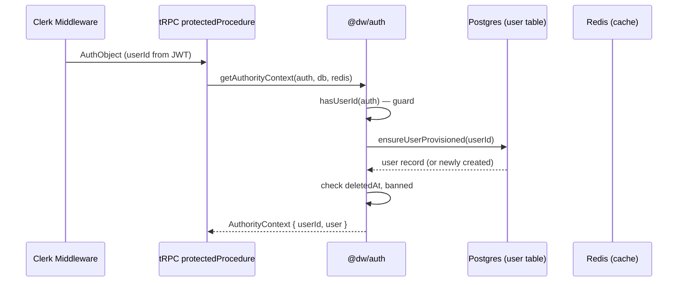

# @dw/auth

Authentication and authorization primitives for the monorepo. Provides Clerk SDK integration, role-based access control (RBAC), user provisioning logic, and typed context objects. Designed to be consumed by both the tRPC API layer and Next.js Server Components.

## Purpose

Decouples auth logic from the API package so it can be tested independently and reused across any server-side package that needs identity assertions. The core abstraction is the `AuthorityContext` — a fully resolved, type-safe representation of a verified user with their database record and role.

## Architecture

```
src/
├── clerk.ts              # Clerk backend client singleton
├── context.ts            # getAuthorityContext() — resolves AuthorityContext from AuthObject
├── errors.ts             # Typed auth error factories (UNAUTHORIZED, BANNED, ACCOUNT_UNAVAILABLE)
├── guards.ts             # Type predicates: hasUserId(), AuthObject type
├── hooks.ts              # React hook wrappers for client-side auth
├── load-authority-user.ts # DB lookup for user by Clerk ID
├── metadata.ts           # Clerk user metadata helpers
├── provision-user.ts     # Upsert user to DB on first login
├── rbac.ts               # assertAdmin(), assertRole(), assertNotBanned()
└── roles.ts              # Role enum: "admin" | "user"
```

### Auth Flow



## Key Exports

```typescript
// Export paths: ".", "./clerk", "./context", "./errors", "./guards"

// Context resolution (used in tRPC middleware)
export async function getAuthorityContext(
  auth: AuthObject,
  db: DbInstance,
  redis: Redis,
): Promise<AuthorityContext>;

// RBAC assertions (throw TRPCError on failure)
export function assertAdmin(ctx: RBACContext): void;
export function assertRole(ctx: RBACContext, role: Role): void;
export function assertNotBanned(ctx: RBACContext): void;
export function assertUser(ctx: RBACContext): void;

// Type guard
export function hasUserId(auth: AuthObject): auth is { userId: string };

// Types
export type AuthorityContext = { userId: string; user: AuthorityUser };
export type Role = "admin" | "user";
export const ROLES: { ADMIN: "admin"; USER: "user" };
```

## Configuration

- Admin determination: users with `role: "admin"` in the `user` table. Admin role is assigned manually in the database.
- `OWNER_EMAILS` env var (from `authEnv()`) can seed initial admin designation in provisioning logic.
- Clerk must be configured with `CLERK_SECRET_KEY` — if absent, `isClerkConfigured()` returns false and auth middleware will not initialize.

## Dependencies

Consumes: `@dw/db`, `@dw/redis`

Consumed by: `@dw/api`, `@dw/nextjs`, `@dw/dev-tools`

## Developer Notes

> **Developer Note**
> `ensureUserProvisioned()` is an upsert — it creates the user record in Postgres on their first authenticated request, using data from the Clerk JWT (email, name). This means the Clerk webhook (`/api/webhooks/clerk`) and the tRPC auth flow are both capable of creating user records. The webhook is used for bulk operations (e.g., deletion); `ensureUserProvisioned` is the primary creation path for interactive logins.
