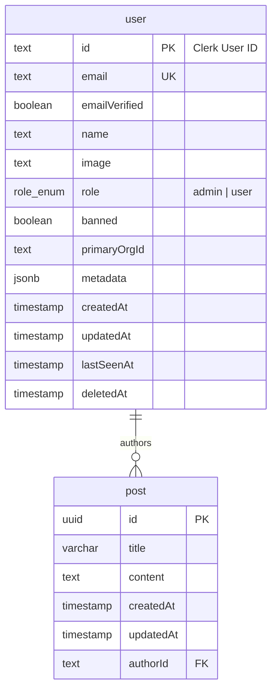

# @dw/db

Database package providing the Drizzle ORM client, schema definitions, and migration files. Uses Supabase (PostgreSQL 16) in production and a local Docker Postgres instance in development.

## Purpose

Centralizes all database schema definitions and the ORM client singleton. Any package that needs to query the database imports `getDb()` or the lazy `db` proxy from this package.

## Architecture

```
src/
├── auth-schema.ts    # user table: id (Clerk ID), email, role, banned, metadata
├── schema.ts         # post table + re-exports auth-schema
├── client.ts         # getDb() singleton factory, lazy db proxy
└── index.ts          # Re-exports

drizzle/              # Generated migration SQL files
drizzle.config.ts     # Drizzle Kit configuration
```

## Database Schema



## Key Exports

```typescript
// Export paths: ".", "./client", "./schema"

// Lazy proxy — safe to import at module load time
export const db: DbInstance

// Factory function — validates env vars and creates connection
export function getDb(): DbInstance
export type DbInstance = PostgresJsDatabase<typeof schema>

// Schema
export { user, roleEnum, Post, CreatePostSchema }
```

### Connection Configuration

The client (`src/client.ts`) configures `postgres.js` for Supabase PgBouncer compatibility:
- `prepare: false` — required for PgBouncer transaction pooler mode
- `max: 3` in production (Supabase free tier limit), `max: 5` in local dev
- `idle_timeout: 30`, `connect_timeout: 10`

The `db` export is a `Proxy` that defers `getDb()` invocation until first property access — this allows safe import at module load time without immediately connecting.

## Dependencies

Consumes: `@dw/validators` (for `dbEnv()` — validates `DATABASE_URL` and `DIRECT_URL`)

Consumed by: `@dw/api`, `@dw/auth`, `@dw/runtime`, `@dw/dev-tools`

## Local Development

```bash
# Generate migration files after schema changes
pnpm dw db generate

# Apply migrations to local Docker DB
pnpm dw db migrate.local

# Push schema directly (no migration file, dev only)
pnpm dw db push.local

# Open Drizzle Studio visual browser
pnpm dw db studio.local
```

Migrations require `DIRECT_URL` (not `DATABASE_URL`) because PgBouncer's transaction pooler does not support the `SET` commands that migration runners use.

## Developer Notes

> **Developer Note**
> Drizzle is configured with `casing: "snake_case"` — TypeScript field names like `authorId` are automatically mapped to `author_id` in SQL. You do not need to manually specify column names for snake_case fields.
