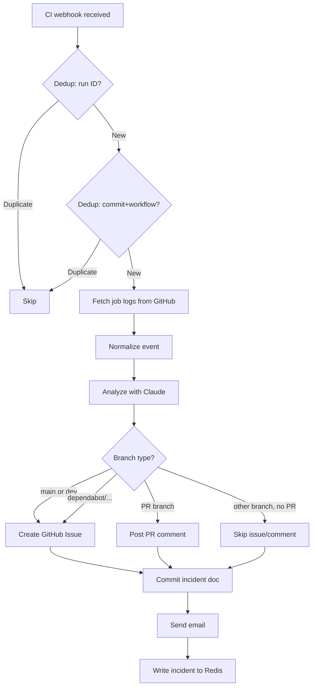

# @dw/ai

The AI agent system for the platform. Implements a multi-agent architecture that autonomously monitors, analyzes, and responds to CI failures, Sentry runtime errors, and GitHub Dependabot security vulnerabilities. Each event type has a dedicated agent that fans out to multiple outputs: GitHub Issues, PR comments, incident documents committed to the repository, Resend email notifications, and Redis incident records.

## Purpose

Provides the core intelligence layer of the DevOps platform. Agents receive normalized `PlatformEvent` objects (from `@dw/contracts`), call Claude via `@dw/llm`, and orchestrate all downstream actions. Redis memory stores incident state that the dashboard reads.

## Architecture

```
src/
├── agent/
│   └── control-loop.ts   # Scheduled polling loop (Sentry + Vercel sensors)
├── analyzers/
│   ├── ci-agent.ts       # runCiAgent() — GitHub CI failure processing
│   ├── sentry-agent.ts   # runSentryAgent() — Sentry error processing
│   └── security-agent.ts # runSecurityAgent() — Dependabot vulnerability processing
├── actions/
│   ├── github.ts         # GitHub API: createIssue(), postPrComment(), commitFile()
│   ├── crypto.ts         # HMAC-SHA256 webhook signature verification
│   ├── incident-doc.ts   # generateAndCommitIncidentDoc() — markdown generation + git commit
│   └── index.ts          # verifyGitHubSignature(), verifySentrySignature()
├── memory/
│   └── redis.ts          # Incident CRUD, event log, dedup, system health — all in Redis
└── sensors/
    ├── github-ci.ts      # fetchCiJobDetails() — GitHub Actions API
    ├── sentry.ts         # fetchSentryIssues() — Sentry REST API
    └── vercel.ts         # getLastProductionDeploy() — Vercel REST API
```

### Agent Execution Modes

| Mode | Trigger | Path |
|---|---|---|
| Webhook (primary) | GitHub/Sentry webhook → QStash → `/api/process/*` | Calls agent directly, low latency |
| Scheduled | Vercel Cron → `runControlLoop()` | Polls Sentry, processes new issues |
| Manual | `pnpm dw platform scan` (CLI) | Calls `runControlLoop()` |

### CI Agent Decision Logic



## Key Exports

```typescript
// Export paths: ".", "./actions", "./agent", "./analyzers", "./memory", "./sensors"

// Main agent entry points (called by /api/process/* routes)
export async function runCiAgent(payload: Record<string, unknown>): Promise<void>
export async function runSentryAgent(payload: Record<string, unknown>): Promise<void>
export async function runSecurityAgent(payload: Record<string, unknown>): Promise<void>

// Scheduled control loop
export async function runControlLoop(): Promise<ControlLoopResult>
export async function checkAgentHealth(): Promise<{ redis: boolean; sentry: boolean; vercel: boolean }>

// Webhook signature verification (used in Edge routes)
export async function verifyGitHubSignature(body: string, signature: string | null): Promise<boolean>
export async function verifySentrySignature(body: string, signature: string | null): Promise<boolean>

// Redis memory (used by the dashboard)
export async function getIncidents(limit?: number, statusFilter?: IncidentStatus[]): Promise<IncidentRecord[]>
export async function getIncident(id: string): Promise<IncidentRecord | null>
export async function updateIncidentStatus(id: string, status: IncidentStatus, meta?: ...): Promise<IncidentRecord | null>
export async function getSystemHealth(): Promise<SystemHealth>
```

### Redis Key Schema

| Key Pattern | Type | TTL | Purpose |
|---|---|---|---|
| `platform:incident:{id}` | String (JSON) | 30d | Individual incident record |
| `platform:incidents:index` | List | 30d | Ordered list of incident IDs (newest first) |
| `platform:events` | List | 7d | Raw PlatformEvent log |
| `ci:failure:{runId}` | String | 24h | CI failure dedup by run ID |
| `ci:commit:{sha}:{workflow}:{branch}` | String | 24h | CI failure dedup by commit |
| `sentry:error:{issueId}` | String | 7d | Sentry/security alert dedup |

## Dependencies

Consumes: `@dw/config`, `@dw/contracts`, `@dw/llm`, `@dw/messaging`, `@dw/runtime`, `@dw/validators`

Consumed by: `@dw/nextjs`

## Developer Notes

> **Developer Note**
> `shouldCreateIssue(branch, prNumber)` in `ci-agent.ts` deliberately includes `dependabot/*` branches in the GitHub Issue creation path. This is intentional: Dependabot creates branches but does not create PRs for vulnerability fixes in the same way. Creating a GitHub Issue for Dependabot CI failures allows the platform's GitHub webhook to detect when that issue is closed and automatically resolve the incident in Redis — providing end-to-end resolution tracking without requiring a PR comment.

> **Developer Note**
> `Promise.allSettled` (not `Promise.all`) is used for the fan-out steps (issue creation, doc commit, email). This ensures all outputs are attempted even if one fails. Individual failures are logged as errors but do not abort the agent or cause QStash to retry. The incident record is written to Redis regardless of whether the GitHub/email outputs succeeded.
